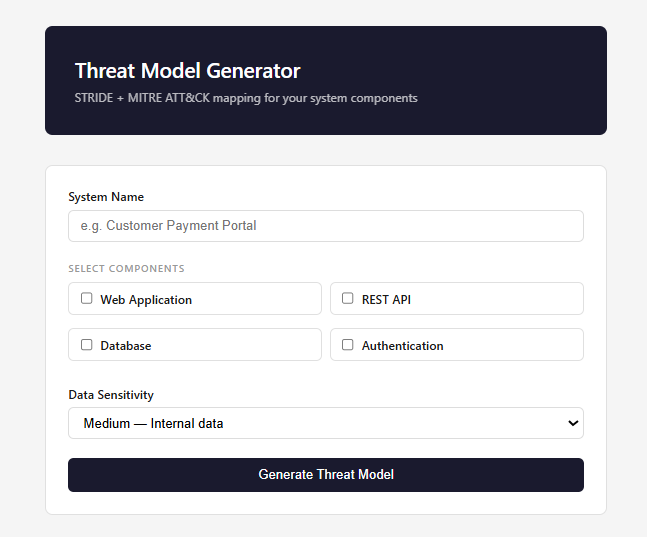
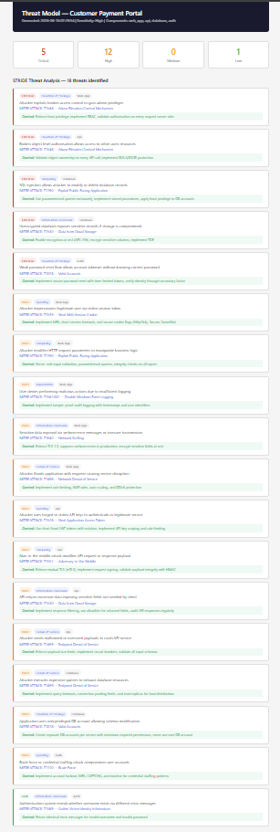

# Threat Model Generator

A Flask web application that generates STRIDE-based threat models with MITRE ATT&CK mappings for system components, producing severity-ranked security reports with remediation controls.

🌐 **Live Demo:** https://threat-model-generator.onrender.com

## Demo

### Input Form


### Generated Report


## What It Does

- Accepts system components as input (Web App, REST API, Database, Authentication)
- Maps each component to STRIDE threat categories (Spoofing, Tampering, Repudiation, Information Disclosure, Denial of Service, Elevation of Privilege)
- Links every threat to a specific MITRE ATT&CK technique
- Adjusts risk severity based on data sensitivity (Low/Medium/High)
- Outputs a clean severity-ranked report with security controls

## Tech Stack

- Python 3.11
- Flask — web framework
- Jinja2 — HTML templating
- pytest — 7 passing tests

## Project Structure

```
threat-model-generator/
├── app.py                    # Flask app, STRIDE logic, routes
├── templates/
│   ├── index.html            # Input form
│   └── report.html           # Threat model report
├── images/
│   ├── screenshot-form.png
│   └── screenshot-report.png
├── tests/
│   └── test_threat_model.py  # Full test suite (7 tests)
├── requirements.txt
└── README.md
```

## Setup

```bash
pip install -r requirements.txt
python app.py
```

Then open: http://127.0.0.1:5000

## Run Tests

```bash
pytest tests/ -v
```

## Test Results

All 7 tests passing:

- Index page loads
- Generate with web app component
- Generate with multiple components
- No components selected shows error
- Threat model logic for web app
- High sensitivity upgrades risk level
- Threats sorted by severity

## STRIDE Coverage

| Category | Description |
|---|---|
| Spoofing | Identity impersonation attacks |
| Tampering | Data and request manipulation |
| Repudiation | Audit trail attacks |
| Information Disclosure | Data exposure threats |
| Denial of Service | Availability attacks |
| Elevation of Privilege | Access control bypass |

## Author

Amarjeet Kaur Dhillon — MSc Cyber Security, University of Southampton

Amazon AWS DC Security Specialist Intern (Sep 2026)

[LinkedIn](https://www.linkedin.com/in/amarjeet-kaur-dhillon-545672214)

[GitHub](https://github.com/AmarjeetkaurDhillon)
